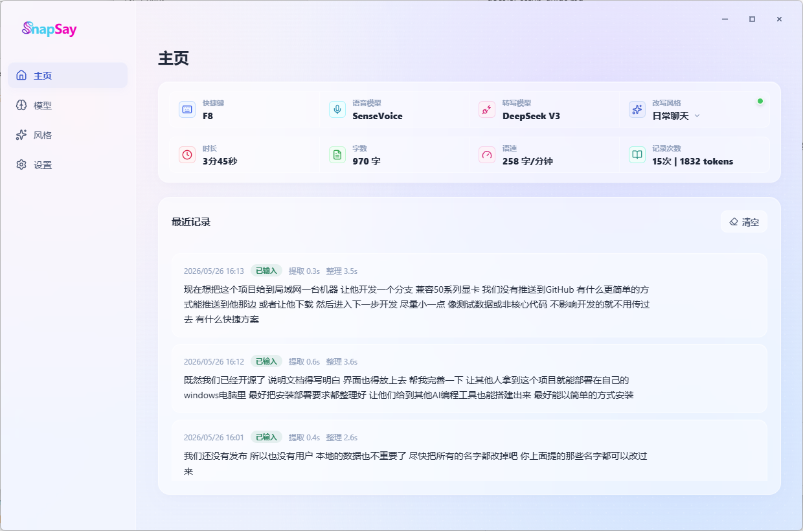
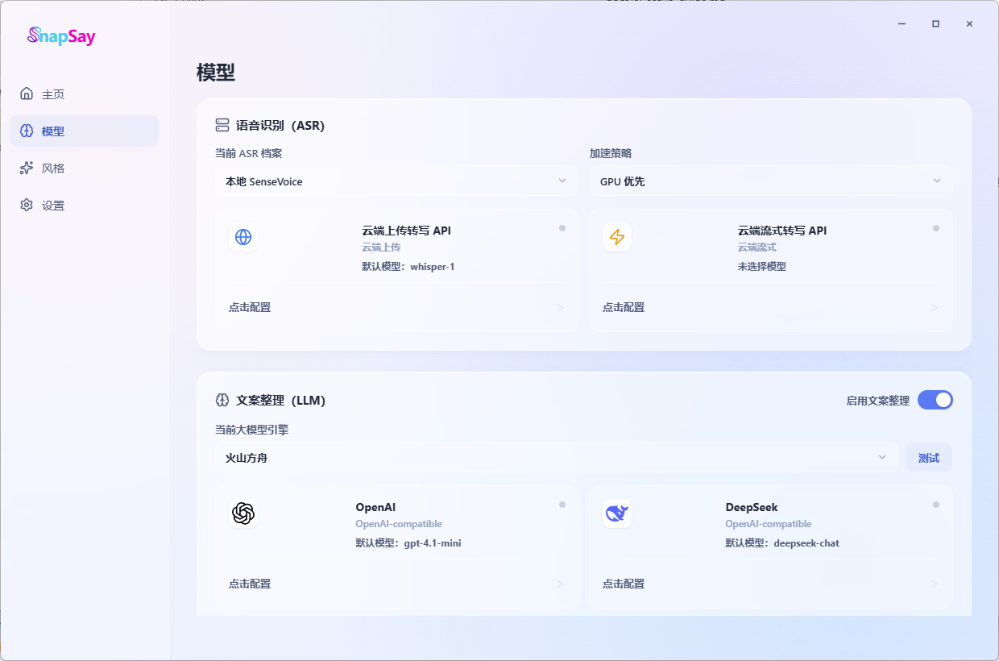
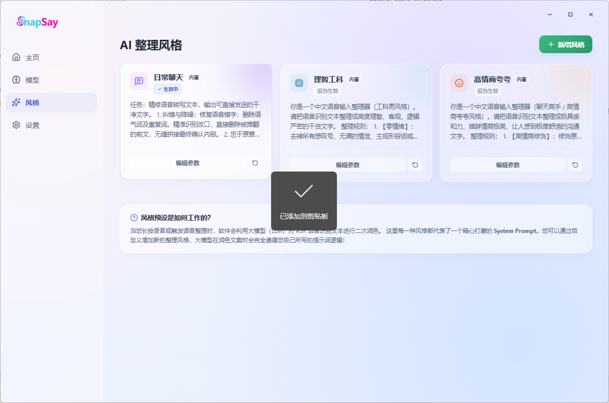
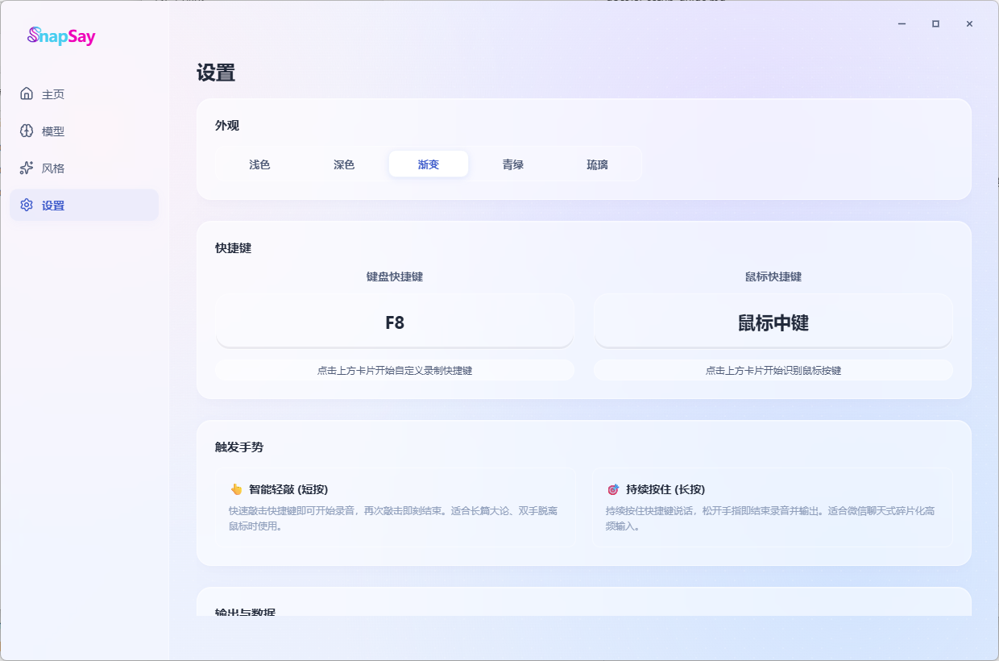

# SnapSay

SnapSay is a Windows desktop voice input assistant. It records from your microphone, transcribes speech with local SenseVoice or a cloud ASR provider, optionally rewrites the transcript with an OpenAI-compatible LLM API, and pastes the final text into the current cursor position.

The project is built with Electron, React, TypeScript, Vite, SQLite, and Python-based local ASR.

## Interface

SnapSay includes four main views:

- Home: current shortcut, ASR model, cleanup model, style, usage statistics, and recent records.
- Models: local/cloud ASR profiles and OpenAI-compatible cleanup provider cards.
- Styles: editable AI cleanup prompt presets.
- Settings: appearance, keyboard and mouse triggers, output mode, data paths, record import/export, and diagnostic logs.









## Features

- Global keyboard trigger and mouse trigger support.
- Floating recording indicator.
- Local SenseVoiceSmall ASR with GPU-first execution and CPU fallback.
- OpenAI-compatible text cleanup providers.
- Clipboard paste into the active application.
- Local SQLite history database.
- Settings for ASR, LLM provider cards, prompt templates, output mode, shortcuts, data paths, and wordbook correction.
- Project-local data layout: runtime data, models, logs, cache, and temp files stay under this repository by default.

## Requirements

Recommended environment:

- Windows 10 or Windows 11.
- PowerShell 7 or Windows PowerShell 5.1.
- Git.
- Node.js 22 or newer. Node 24 works.
- npm 10 or newer.
- Python 3.10 for local ASR.
- FFmpeg available in `PATH` for local ASR smoke tests and non-WAV audio fallback.
- NVIDIA GPU with CUDA support is recommended for local SenseVoice. CPU fallback is available but slower.

Native dependency notes:

- The app uses `better-sqlite3`, which must be rebuilt for Electron.
- `npm install` runs `npm run rebuild:native` automatically.
- If native rebuild falls back to source compilation, install Visual Studio Build Tools with the C++ desktop workload.

## Quick Start

Clone and install:

```powershell
git clone https://github.com/LIU-ZHIHAO/SnapSay.git D:\Antigravity\SnapSay
cd D:\Antigravity\SnapSay
npm install
npm run build
npm run electron
```

One-command Windows setup:

```powershell
.\scripts\setup-windows.ps1
```

To also install local SenseVoice ASR dependencies and download the model:

```powershell
.\scripts\setup-windows.ps1 -WithLocalAsr
```

The local ASR setup can be large because it installs CUDA-enabled PyTorch and downloads `SenseVoiceSmall`.

## Development

Start the Vite development server on the project-defined high port:

```powershell
npm run dev
```

Build the renderer and Electron main process:

```powershell
npm run build
```

Run tests:

```powershell
npm test
```

Launch the production-built Electron app:

```powershell
npm run electron
```

## Local ASR Setup

Install Python dependencies and download SenseVoiceSmall:

```powershell
.\scripts\setup-python-asr.ps1
```

Smoke test the local ASR:

```powershell
.\scripts\test-local-asr.ps1
```

The setup script creates:

- `.venv\` for Python dependencies.
- `models\sensevoice\SenseVoiceSmall\` for the model.
- `cache\` for pip, Hugging Face, ModelScope, and Torch caches.

No model, cache, log, database, or runtime data is intentionally written to the Windows user profile by the project scripts.

## Runtime Data

Runtime files are ignored by git and stored under the project by default:

```text
data\       Settings, SQLite database, ASR daemon port file, Electron userData
logs\       Application and diagnostic logs
cache\      npm, pip, Hugging Face, ModelScope, Torch caches
models\     Local ASR models
tmp\        Temporary audio and ASR output files
```

Important files:

- `data\snapsay-settings.json`: local app settings and API provider configuration.
- `data\snapsay.db`: transcription history database.
- `data\asr-daemon.port`: local ASR daemon port used by the Electron main process.

Do not commit files from these runtime directories.

## Configure the App

1. Open SnapSay.
2. Go to the model settings page.
3. Choose local SenseVoice or configure a cloud ASR profile.
4. Configure an OpenAI-compatible cleanup provider if you want rewritten text.
5. Test the cleanup provider connection.
6. Choose an output mode: paste to cursor, copy to clipboard, or save history only.
7. Configure the keyboard or mouse trigger.

API keys are stored in the local settings file and should never be committed.

## Troubleshooting

### `better_sqlite3.node was compiled against a different Node.js version`

Rebuild native modules for Electron:

```powershell
npm run rebuild:native
```

If this fails because the file is locked, close all SnapSay/Electron processes and retry.

### Local ASR is very slow

Check whether the daemon is running:

```powershell
Test-Path .\data\asr-daemon.port
```

If the port file does not exist, reinstall local ASR dependencies:

```powershell
.\scripts\setup-python-asr.ps1
```

Then restart the app.

### `ModuleNotFoundError: No module named 'av'`

Install local ASR dependencies again:

```powershell
.\scripts\setup-python-asr.ps1
```

### Python, model, or FFmpeg path issues

Use project-local defaults when possible:

```text
Python: .venv\Scripts\python.exe
Model:  models\sensevoice\SenseVoiceSmall
Cache:  cache\
Temp:   tmp\
```

Install FFmpeg and make sure `ffmpeg.exe` is available in `PATH`.

## Repository Layout

```text
src\main\       Electron main process, IPC, providers, settings, SQLite records
src\renderer\   React UI and floating recorder UI
src\shared\     Shared defaults, types, validation, cleanup policy
scripts\        Windows setup, local ASR setup, local ASR smoke test
tests\          Vitest coverage for renderer, providers, settings, records, validation
docs\           Product specs and AI setup guide
mockups\        UI mockups used in documentation
```

## AI-Assisted Setup

If you want another AI coding tool to set up this repository, give it this file plus `docs/ai-setup-guide.md`. The short instruction is:

```text
Set up SnapSay on Windows. Keep all runtime data, models, logs, and caches inside the project directory. Install npm dependencies, rebuild Electron native modules, optionally run scripts/setup-python-asr.ps1 for local SenseVoice ASR, then verify with npm test and npm run build.
```

## License

SnapSay is licensed under the PolyForm Noncommercial License 1.0.0.

Commercial use is prohibited unless you obtain a separate written commercial license from the copyright holder. See [LICENSE.md](LICENSE.md).
